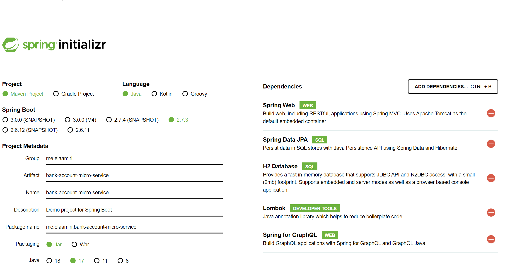
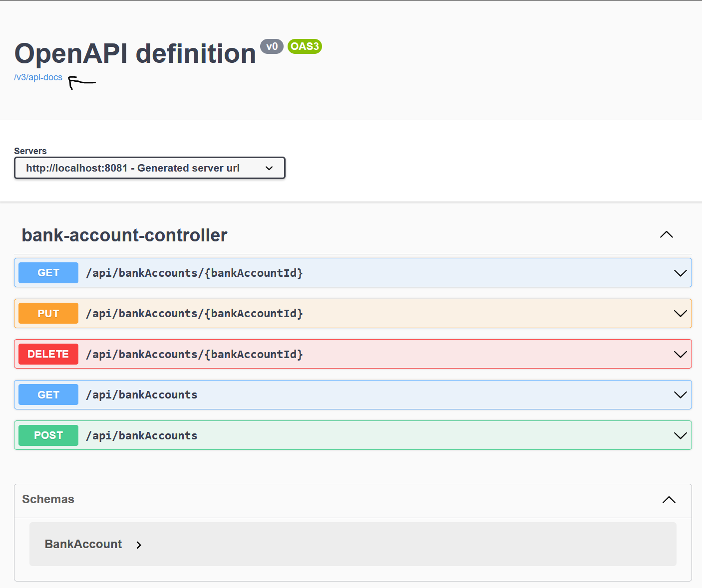
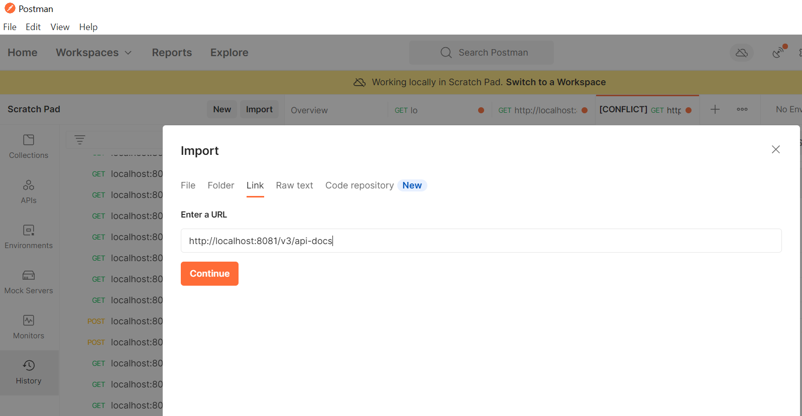
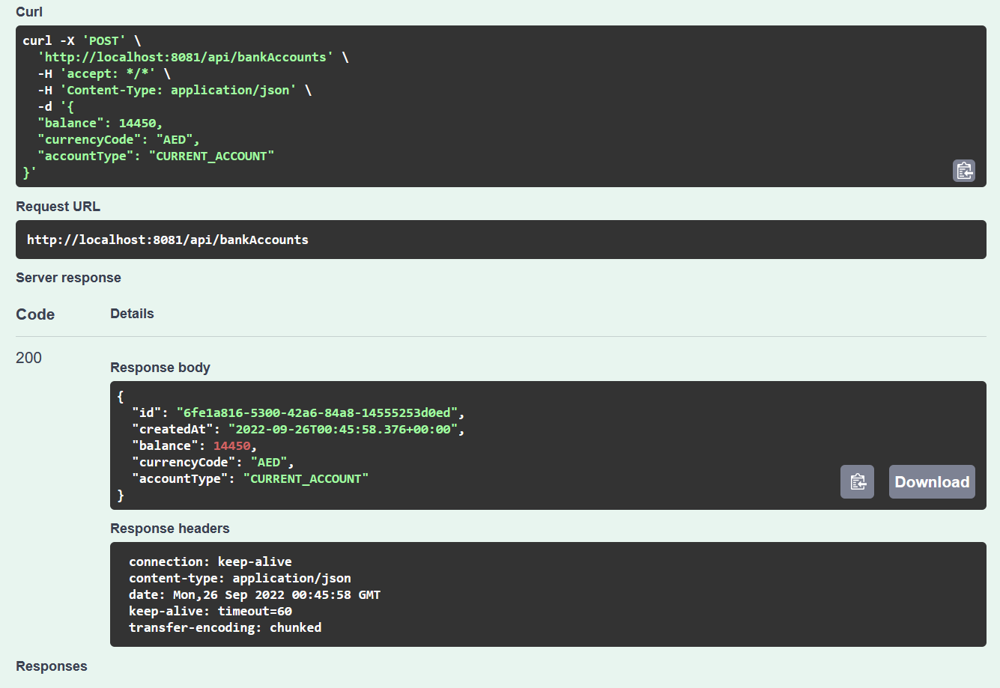

## Activity 1 
### Micro-services Spring 
#### Initializing the project 




There is two types of Spring:
1. Classic Spring MVC, Based on the imperative programming.
2. Reactive Spring (WebFlux), Based on the interactive programming.

Resources:
[Part 1- De L'impératif vers le réactif- Reactive Programming avec Spring Web FLUX-Concepts de base: Professeur Mohamed YOUSSFI](https://www.youtube.com/watch?v=h58yIiHgoBg)
[Build Reactive RESTFUL APIs using Spring Boot/WebFlux : Code With Dilip  19](https://www.youtube.com/watch?v=IK26KdGRl48&list=PLnXn1AViWyL70R5GuXt_nIDZytYBnvBdd)


<fieldset>
    <legend>Note:</legend>
    Intellij Idea could throw a maven error 

```diff
-Plugin 'org.springframework.boot:spring-boot-maven-plugin:' not found or can not be resolved
```
that can be solved by adding the version of the plugin in the pom.xml, which is the same of spring boot's version. (and it's working since spring boot 2.2 until 2.7.X)

```xml
<plugin>
    <groupId>org.springframework.boot</groupId>
    <artifactId>spring-boot-maven-plugin</artifactId>
    <version>${project.parent.version}</version>
    <configuration>
        <excludes>
            <exclude>
                <groupId>org.projectlombok</groupId>
                <artifactId>lombok</artifactId>
            </exclude>
        </excludes>
    </configuration>
</plugin>
```
</fieldset>


#### Entities 
[BankAccount Entity](src/main/java/me/elaamiri/bankaccountmicroservice/entities/BankAccount.java)
````java
@Entity
@Data
@AllArgsConstructor
@NoArgsConstructor
@Builder
/*
Builder is a design pattern : https://refactoring.guru/design-patterns/builder
Builder is a creational design pattern that lets you construct complex objects step by step. The pattern allows you to produce different types and representations of an object using the same construction code.

*/
public class BankAccount {
    @Id
    private String id;
    @DateTimeFormat(pattern = "YYYY-MM-DD")
    @Temporal(TemporalType.DATE)
    private Date createdAt;
    // private double balance;
    private Double balance; // to avoid error on update
    @Enumerated(EnumType.STRING)
    private CurrencyCode currencyCode;
    @Enumerated(EnumType.STRING)
    private AccountType accountType;

}
````

**Notes**:
- [Builder pattern](https://refactoring.guru/design-patterns/builder)


#### Repositories 
[BankAccountRepository](src/main/java/me/elaamiri/bankaccountmicroservice/repositories/BankAccountRepository.java)

````java
@Repository
public interface BankAccountRepository extends JpaRepository<BankAccount, String> {
}
````

#### Configring our App
````properties
spring.datasource.url=jdbc:h2:mem:accounts-db
spring.h2.console.enabled=true
server.port=8081
````

#### Testing our implementation

In the main point [BankAccountMicroServiceApplication](src/main/java/me/elaamiri/bankaccountmicroservice/BankAccountMicroServiceApplication.java)
````java
@Bean
	CommandLineRunner start(BankAccountRepository bankAccountRepository){
            return new CommandLineRunner() {
    @Override
    public void run(String... args) throws Exception {
            // creating some test data
            for (int i=0; i<10; i++ ){
            // using the builder
            BankAccount bankAccount = BankAccount.builder()
            .id(UUID.randomUUID().toString())
            .accountType(Math.random()>0.5 ? AccountType.CURRENT_ACCOUNT : AccountType.SAVING_ACCOUNT)
            .balance(2000+ (Math.random() * 500000))
            .currencyCode(CurrencyCode.MAD)
            .build();
            bankAccountRepository.save(bankAccount);
            }
            }
            };
            }
````


>> It seems like, the application have been started in a big duration (13 seconds),
> and that is not normal.
> As a solution we could create Native applications using

[GraalVM](https://www.graalvm.org/)

> It is a virtual machine lets us recompile jar files to be Native apps.
> "GraalVM is a high-performance JDK distribution designed to accelerate the execution of applications written in Java and other JVM languages along with ..."

[Run Code in Any Language Anywhere with GraalVM : Oracle Developers](https://www.youtube.com/watch?v=JoDOo4FyYMU)

#### Res
Visit : `http:localhost:8081/h2-console`


#### Controllers (Web)

[BankAccountController](src/main/java/me/elaamiri/bankaccountmicroservice/controllers/BankAccountController.java)

<details>

````java

@RestController
@RequestMapping("/api")
public class BankAccountController {
    // Dependency injection by constructor
    BankAccountRepository bankAccountRepository;
    public BankAccountController(BankAccountRepository bankAccountRepository){
        this.bankAccountRepository = bankAccountRepository;
    }


    // Routes
    @GetMapping("/bankAccounts")
    /*
    The route has the same name of the entity
     */
    public List<BankAccount> getBankAccounts(){
        return bankAccountRepository.findAll();
    }

    @GetMapping("/bankAccounts/{bankAccountId}")
    public BankAccount getBankAccount(@PathVariable(name = "bankAccountId") String bankAccountId){
        return bankAccountRepository.findById(bankAccountId)
                .orElseThrow(()-> new RuntimeException(String.format("No bankAccount with the ID: %s found !", bankAccountId)));

    }

    @PostMapping("/bankAccounts")
    public BankAccount saveBankAccount(@RequestBody(required = true) BankAccount bankAccount){
        bankAccount.setId(UUID.randomUUID().toString());
        return  bankAccountRepository.save(bankAccount);
    }

    @PutMapping("/bankAccounts/{bankAccountId}")
    public BankAccount updateBankAccount(@RequestBody(required = true) BankAccount bankAccount, @PathVariable String bankAccountId){
        BankAccount bankAccount1 = bankAccountRepository.findById(bankAccountId).orElse(null);
        /**
         * Tests to filter if the user does not update a field
         */
        if(bankAccount1 == null) new RuntimeException(String.format("No bankAccount with the ID: %s found !", bankAccountId));
        if (bankAccount.getBalance() != null) bankAccount1.setBalance(bankAccount.getBalance());
        if (bankAccount.getCreatedAt() != null) bankAccount1.setCreatedAt(bankAccount.getCreatedAt());
        if (bankAccount.getAccountType() != null) bankAccount1.setAccountType(bankAccount.getAccountType());
        if (bankAccount.getCurrencyCode() != null) bankAccount1.setCurrencyCode(bankAccount.getCurrencyCode());
        return bankAccountRepository.save(bankAccount1);
    }

    @DeleteMapping("/bankAccounts/{bankAccountId}")
    public void deleteBankAccount(@PathVariable String bankAccountId){
        bankAccountRepository.deleteById(bankAccountId);
    }
}

````

</details>

#### Tests

`http://localhost:8081/api/bankAccounts/8479595d-5e67-4fec-b903-4ead82fbef72`

````json
{"id":"8479595d-5e67-4fec-b903-4ead82fbef72","createdAt":null,"balance":183873.7431515834,"currencyCode":"MAD","accountType":"SAVING_ACCOUNT"}
````
`http://localhost:8081/api/bankAccounts/`

<details>

```json
[
    {
        "id": "8479595d-5e67-4fec-b903-4ead82fbef72",
        "createdAt": null,
        "balance": 183873.7431515834,
        "currencyCode": "MAD",
        "accountType": "SAVING_ACCOUNT"
    },
    {
        "id": "fdc40256-9a52-49be-88c3-c2502049bfd4",
        "createdAt": null,
        "balance": 289092.2054572128,
        "currencyCode": "MAD",
        "accountType": "SAVING_ACCOUNT"
    },
    {
        "id": "765d1160-70ed-4bd5-83a6-b56dfb53779c",
        "createdAt": null,
        "balance": 462604.50693428,
        "currencyCode": "MAD",
        "accountType": "SAVING_ACCOUNT"
    },
    {
        "id": "67072645-6a81-4a5a-8499-9f944b0a9674",
        "createdAt": null,
        "balance": 136415.3308109221,
        "currencyCode": "MAD",
        "accountType": "CURRENT_ACCOUNT"
    },
    {
        "id": "5b5533b5-404c-448d-8a8d-65dbe0d9c0a1",
        "createdAt": null,
        "balance": 79710.39542196134,
        "currencyCode": "MAD",
        "accountType": "CURRENT_ACCOUNT"
    },
    {
        "id": "7ee29843-dd5c-44b3-a85f-a8dc7efa8b9f",
        "createdAt": null,
        "balance": 315153.6307580424,
        "currencyCode": "MAD",
        "accountType": "SAVING_ACCOUNT"
    },
    {
        "id": "c853d3cc-bd5d-4902-b6a5-95335cff12c2",
        "createdAt": null,
        "balance": 273990.5395007575,
        "currencyCode": "MAD",
        "accountType": "SAVING_ACCOUNT"
    },
    {
        "id": "5696c3e0-35ea-46c0-8cc0-090f9a0715c9",
        "createdAt": null,
        "balance": 377142.2464782732,
        "currencyCode": "MAD",
        "accountType": "SAVING_ACCOUNT"
    },
    {
        "id": "e071bf08-8839-490d-b00a-c603e7b67a39",
        "createdAt": null,
        "balance": 144073.02288542545,
        "currencyCode": "MAD",
        "accountType": "SAVING_ACCOUNT"
    },
    {
        "id": "8d3d767a-85c8-4e03-84ff-f06cf5b71a01",
        "createdAt": null,
        "balance": 14056.283920548361,
        "currencyCode": "MAD",
        "accountType": "CURRENT_ACCOUNT"
    }
]
```

</details>

```json
POST:
{
        "createdAt": "2022-09-22",
        "balance": 377142.02,
        "currencyCode": "MAD",
        "accountType": "SAVING_ACCOUNT"
    }
Response:

{
    "id": "3764e924-93e8-4d2d-82d7-7667526ca5d6",
    "createdAt": "2022-09-22T00:00:00.000+00:00",
    "balance": 377142.02,
    "currencyCode": "MAD",
    "accountType": "SAVING_ACCOUNT"
}
```

````json
PUT:
{
"createdAt": "2022-09-22",
"balance": 200.02
}

Response:
{
"id": "3764e924-93e8-4d2d-82d7-7667526ca5d6",
"createdAt": "2022-09-22T00:00:00.000+00:00",
"balance": 200.02,
"currencyCode": "MAD",
"accountType": "SAVING_ACCOUNT"
}
````


#### Notes:
- With SAOP , we must return XML result necessarily 
- With REST, we are free to use JSON, XML

_______________________

#### Adding Swagger Documentation to our API

To do that, we should use the dependency  to `pom.xml`:

````xml
<!-- https://mvnrepository.com/artifact/org.springdoc/springdoc-openapi-ui -->
<dependency>
    <groupId>org.springdoc</groupId>
    <artifactId>springdoc-openapi-ui</artifactId>
    <version>1.6.11</version>
</dependency>


````

Visiting the API documentation by : `http://localhost:8081/swagger-ui/index.html`



When we click `/v3/api-docs` it returns the documentation as JSON, we can after use it on any testing app like `Postman`
it presents the interface of our web service, and all its end points (inputs & outputs).

To use the documentation with `Postman`, we can import it by the url `http://localhost:8081/v3/api-docs` .
and test the collection



_______________

#### Spring Data Rest
If we want to create a REST API without the need to use a service layer, we can use `Spring data REST`, to generate a basic
REST API.
to use it we should add the dependency:

```xml
 <dependency>
    <groupId>org.springframework.boot</groupId>
    <artifactId>spring-boot-starter-data-rest</artifactId>
</dependency>
```
Now Spring will create a  generic Rest API
To create be able to use the Rest of an entity we should use the
annotation `@RepositoryRestResource` to the Repository,
By that annotation, we tell Spring to create a Restful web service in starting 
for this entity, So it creates all the routes needed to manage the `BankAccount` entity.


````java
@Repository
@RepositoryRestResource
public interface BankAccountRepository extends JpaRepository<BankAccount, String> {
}
````

Now when we visit `http://localhost:8081/bankAccounts/` we get the same result as 
`http://localhost:8081/api/bankAccounts/`

Lets test : GET: `http://localhost:8081/bankAccounts/84bf2d10-5c96-4da6-abf2-051a5ea6e0c1`

```json
{
  "createdAt" : null,
  "balance" : 320654.3739183558,
  "currencyCode" : "MAD",
  "accountType" : "SAVING_ACCOUNT",
  "_links" : {
    "self" : {
      "href" : "http://localhost:8081/bankAccounts/84bf2d10-5c96-4da6-abf2-051a5ea6e0c1"
    },
    "bankAccount" : {
      "href" : "http://localhost:8081/bankAccounts/84bf2d10-5c96-4da6-abf2-051a5ea6e0c1"
    }
  }
}
```
This method support the pagination by default.

We can add a function in the repository and access it in the API:

```java

@Repository
@RepositoryRestResource
public interface BankAccountRepository extends JpaRepository<BankAccount, String> {
    List<BankAccount> findByAccountType(AccountType accountType);
}

```

Visiting  : GET: `http://localhost:8081/bankAccounts/search/findByAccountType?accountType=SAVING_ACCOUNT`

<details>

```json
{
  "_embedded" : {
    "bankAccounts" : [ {
      "createdAt" : null,
      "balance" : 339803.30055158166,
      "currencyCode" : "MAD",
      "accountType" : "SAVING_ACCOUNT",
      "_links" : {
        "self" : {
          "href" : "http://localhost:8081/bankAccounts/cb84546a-3f52-4064-8d5e-c7a0edb56512"
        },
        "bankAccount" : {
          "href" : "http://localhost:8081/bankAccounts/cb84546a-3f52-4064-8d5e-c7a0edb56512"
        }
      }
    }, {
      "createdAt" : null,
      "balance" : 79752.819672261,
      "currencyCode" : "MAD",
      "accountType" : "SAVING_ACCOUNT",
      "_links" : {
        "self" : {
          "href" : "http://localhost:8081/bankAccounts/612b6411-6c95-4ce7-96cd-02a02d4aec0f"
        },
        "bankAccount" : {
          "href" : "http://localhost:8081/bankAccounts/612b6411-6c95-4ce7-96cd-02a02d4aec0f"
        }
      }
    }, {
      "createdAt" : null,
      "balance" : 483333.4589509526,
      "currencyCode" : "MAD",
      "accountType" : "SAVING_ACCOUNT",
      "_links" : {
        "self" : {
          "href" : "http://localhost:8081/bankAccounts/70d26a0c-3aaf-4f40-be5d-9754c4cef973"
        },
        "bankAccount" : {
          "href" : "http://localhost:8081/bankAccounts/70d26a0c-3aaf-4f40-be5d-9754c4cef973"
        }
      }
    }, {
      "createdAt" : null,
      "balance" : 403826.0998516515,
      "currencyCode" : "MAD",
      "accountType" : "SAVING_ACCOUNT",
      "_links" : {
        "self" : {
          "href" : "http://localhost:8081/bankAccounts/46147c41-1812-4851-855c-9b1405a33ba1"
        },
        "bankAccount" : {
          "href" : "http://localhost:8081/bankAccounts/46147c41-1812-4851-855c-9b1405a33ba1"
        }
      }
    }, {
      "createdAt" : null,
      "balance" : 141420.15969475606,
      "currencyCode" : "MAD",
      "accountType" : "SAVING_ACCOUNT",
      "_links" : {
        "self" : {
          "href" : "http://localhost:8081/bankAccounts/fa9949c0-0d6c-4dcb-a20a-5c01e04bc44c"
        },
        "bankAccount" : {
          "href" : "http://localhost:8081/bankAccounts/fa9949c0-0d6c-4dcb-a20a-5c01e04bc44c"
        }
      }
    } ]
  },
  "_links" : {
    "self" : {
      "href" : "http://localhost:8081/bankAccounts/search/findByAccountType?accountType=SAVING_ACCOUNT"
    }
  }
}
```

</details>

By adding `@RestRessource()` we give a path to access the method 

```java
@Repository
@RepositoryRestResource
public interface BankAccountRepository extends JpaRepository<BankAccount, String> {

    @RestResource(path = "/byType")
    List<BankAccount> findByAccountType(@Param("type") AccountType accountType);
}
```
So we can access with : GET: `http://localhost:8081/bankAccounts/search/byType?type=SAVING_ACCOUNT`


#### Projections in Spring Data REST
By this feature we can demand a custom output, lets say for example
we want the objet of output just with the balance and the type:
We should creat an interface `BankAccountProjection` in `entities` package

```java

@Projection(name = "projection1" , types = BankAccount.class)
public interface AccountProjection {
    /*
    needed attributes
     */

    public Double getBalance();
    public AccountType getAccountType();
}

```
To use the projection : ex. GET:`http://localhost:8081/bankAccounts/search/findByAccountType?accountType=SAVING_ACCOUNT&projection=projection1`
<details>

```json
{
  "_embedded" : {
    "bankAccounts" : [ {
      "balance" : 189805.5235331379,
      "accountType" : "SAVING_ACCOUNT",
      "_links" : {
        "self" : {
          "href" : "http://localhost:8081/bankAccounts/1a42e826-d39f-4420-ba0d-825c01375520"
        },
        "bankAccount" : {
          "href" : "http://localhost:8081/bankAccounts/1a42e826-d39f-4420-ba0d-825c01375520{?projection}",
          "templated" : true
        }
      }
    }, {
      "balance" : 458320.38515820773,
      "accountType" : "SAVING_ACCOUNT",
      "_links" : {
        "self" : {
          "href" : "http://localhost:8081/bankAccounts/25e2baad-4c3f-4c9f-a124-fc557e4ccbf2"
        },
        "bankAccount" : {
          "href" : "http://localhost:8081/bankAccounts/25e2baad-4c3f-4c9f-a124-fc557e4ccbf2{?projection}",
          "templated" : true
        }
      }
    }, {
      "balance" : 249186.54091118442,
      "accountType" : "SAVING_ACCOUNT",
      "_links" : {
        "self" : {
          "href" : "http://localhost:8081/bankAccounts/ccfa0128-3139-42ea-ab54-7a0967d3bc0b"
        },
        "bankAccount" : {
          "href" : "http://localhost:8081/bankAccounts/ccfa0128-3139-42ea-ab54-7a0967d3bc0b{?projection}",
          "templated" : true
        }
      }
    }, {
      "balance" : 484152.1336563378,
      "accountType" : "SAVING_ACCOUNT",
      "_links" : {
        "self" : {
          "href" : "http://localhost:8081/bankAccounts/57299554-f7fd-4527-a404-a7f40a42c6cb"
        },
        "bankAccount" : {
          "href" : "http://localhost:8081/bankAccounts/57299554-f7fd-4527-a404-a7f40a42c6cb{?projection}",
          "templated" : true
        }
      }
    }, {
      "balance" : 72998.7866422046,
      "accountType" : "SAVING_ACCOUNT",
      "_links" : {
        "self" : {
          "href" : "http://localhost:8081/bankAccounts/f03a0f54-5112-4a25-ac47-8905542bf10a"
        },
        "bankAccount" : {
          "href" : "http://localhost:8081/bankAccounts/f03a0f54-5112-4a25-ac47-8905542bf10a{?projection}",
          "templated" : true
        }
      }
    }, {
      "balance" : 265320.69103873917,
      "accountType" : "SAVING_ACCOUNT",
      "_links" : {
        "self" : {
          "href" : "http://localhost:8081/bankAccounts/b36ef7e1-444c-4d0f-a370-989a55860d12"
        },
        "bankAccount" : {
          "href" : "http://localhost:8081/bankAccounts/b36ef7e1-444c-4d0f-a370-989a55860d12{?projection}",
          "templated" : true
        }
      }
    } ]
  },
  "_links" : {
    "self" : {
      "href" : "http://localhost:8081/bankAccounts/search/findByAccountType?accountType=SAVING_ACCOUNT&projection=projection1"
    }
  }
}
```

</details>

With this extraordinary feature we can custom the output of our REST API.

________________


#### Creating DTOs
```java
@Data
@AllArgsConstructor
@NoArgsConstructor
@Builder
public class BankAccountResponseDTO {
    private String id;
    private Date createdAt;
    // private double balance;
    private Double balance; // to avoid error on update
    private CurrencyCode currencyCode;
    private AccountType accountType;
}

//--------

public class BankAccountRequestDTO {
    /**
     * For request DTOs we keep just what we need in input
     */
    private Double balance; // to avoid error on update
    private CurrencyCode currencyCode;
    private AccountType accountType;
}
```


#### Service layer (Interface & implementation)
`@Service`

```java
@Service
public interface BankAccountService {
    // Without DTO
    public BankAccount insertAccount(Double initialBalance, AccountType accountType);

    // using DTOs: that is one cause why we should use DTOs
    public BankAccountResponseDTO insertAccount(BankAccountRequestDTO bankAccountDTO);
}

```

Implementation , do not forget the `@Service` and `@Transactional` annotations.

<details>

````java 
@Service
@Transactional // import org.springframework.transaction.annotation.Transactional;
public class BankAccountServiceImp implements BankAccountService {
    BankAccountRepository bankAccountRepository;
    public BankAccountServiceImp(BankAccountRepository bankAccountRepository){
        this.bankAccountRepository  = bankAccountRepository;
    }
    @Override
    public BankAccount insertAccount(Double initialBalance, AccountType accountType) {
        /*
        Doing some 'metier' code
         */
        return null;
    }

    @Override
    public BankAccountResponseDTO insertAccount(BankAccountRequestDTO bankAccountDTO) {
        // Mapping
        BankAccount bankAccount = BankAccount.builder()
                .id(UUID.randomUUID().toString())
                .accountType(bankAccountDTO.getAccountType())
                .currencyCode(bankAccountDTO.getCurrencyCode())
                .createdAt(new Date())
                .balance(bankAccountDTO.getBalance())
                .build();
        BankAccount savedAccount = bankAccountRepository.save(bankAccount);

        return BankAccountResponseDTO.builder()
                .id(savedAccount.getId())
                .balance(savedAccount.getBalance())
                .createdAt(savedAccount.getCreatedAt())
                .accountType(savedAccount.getAccountType())
                .currencyCode(savedAccount.getCurrencyCode())
                .build();
    }

}

````
</details>

In this case we did a manual mapping, but we should create another class 
called `BankAccountMapper` to keep do this for us, to avoid the code repeating;

No we can edit the controller code and use the DTOs instead of the Entities.

```java 
@PostMapping("/bankAccounts")
    public BankAccountResponseDTO saveBankAccount(@RequestBody(required = true) BankAccountRequestDTO bankAccount){
        //if(bankAccount.getId() == null ) bankAccount.setId(UUID.randomUUID().toString());
        //return  bankAccountRepository.save(bankAccount);
        return bankAccountService.insertAccount(bankAccount);
    }
```

RES




#### Mappers 

Interface
```java
@Component
public interface BankAccountMapper {
    BankAccount fromBankAccountRequestDTO(BankAccountRequestDTO bankAccountRequestDTO);
    BankAccountResponseDTO fromBankAccount(BankAccount bankAccount );
}

```

Impl

```java
@Component
public class BankAccountMapperImp implements BankAccountMapper{
    @Override
    public BankAccount fromBankAccountRequestDTO(BankAccountRequestDTO bankAccountRequestDTO) {
        //
        BankAccount bankAccount = new BankAccount();
        BeanUtils.copyProperties(bankAccountRequestDTO, bankAccount);
        return bankAccount;
    }

    @Override
    public BankAccountResponseDTO fromBankAccount(BankAccount bankAccount) {
        BankAccountResponseDTO bankAccountResponseDTO = new BankAccountResponseDTO();
        BeanUtils.copyProperties(bankAccount, bankAccountResponseDTO);
        return bankAccountResponseDTO;
    }
}
```

Or we can use `ModuleMpper` [ http://modelmapper.org/getting-started/ ]

Usage 

<details>

```java
@Service
@Transactional // import org.springframework.transaction.annotation.Transactional;
public class BankAccountServiceImp implements BankAccountService {
    BankAccountRepository bankAccountRepository;
    BankAccountMapper bankAccountMapper;
    public BankAccountServiceImp(BankAccountRepository bankAccountRepository, BankAccountMapper bankAccountMapper){
        this.bankAccountRepository  = bankAccountRepository;
        this.bankAccountMapper = bankAccountMapper;
    }
    @Override
    public BankAccount insertAccount(Double initialBalance, AccountType accountType) {
        /*
        Doing some 'metier' code
         */
        return null;
    }

    @Override
    public BankAccountResponseDTO insertAccount(BankAccountRequestDTO bankAccountDTO) {
        // Mapping
        /*
        BankAccount bankAccount = BankAccount.builder()
                .id(UUID.randomUUID().toString())
                .accountType(bankAccountDTO.getAccountType())
                .currencyCode(bankAccountDTO.getCurrencyCode())
                .createdAt(new Date())
                .balance(bankAccountDTO.getBalance())
                .build();

         */
        // Using mappers
        BankAccount savedAccount = bankAccountRepository.save(bankAccountMapper.fromBankAccountRequestDTO(bankAccountDTO));
        /*
        return BankAccountResponseDTO.builder()
                .id(savedAccount.getId())
                .balance(savedAccount.getBalance())
                .createdAt(savedAccount.getCreatedAt())
                .accountType(savedAccount.getAccountType())
                .currencyCode(savedAccount.getCurrencyCode())
                .build();

         */
        return bankAccountMapper.fromBankAccount(savedAccount);
    }

}
```

</details>

// Tested 
Exception:
<pre>
ids for this class must be manually assigned before calling save(): me.elaamiri.bankaccountmicroservice.entities.BankAccount
</pre>

// Lets correct the problems
<details>

```diff
- The Exception: org.hibernate.id.IdentifierGenerationException: ids for this class must be manually assigned before calling save(): me.elaamiri.bankaccountmicroservice.entities.BankAccount
	at org.hibernate.id.Assigned.generate(Assigned.java:33) ~[hibernate-core-5.6.10.Final.jar:5.6.10.Final]
	at org.hibernate.event.internal.AbstractSaveEventListener.saveWithGeneratedId(AbstractSaveEventListener.java:115) ~[hibernate-core-5.6.10.Final.jar:5.6.10.Final]
	at org.hibernate.event.internal.DefaultPersistEventListener.entityIsTransient(DefaultPersistEventListener.java:185) ~[hibernate-core-5.6.10.Final.jar:5.6.10.Final]
	at org.hibernate.event.internal.DefaultPersistEventListener.onPersist(DefaultPersistEventListener.java:128) ~[hibernate-core-5.6.10.Final.jar:5.6.10.Final]
	at org.hibernate.event.internal.DefaultPersistEventListener.onPersist(DefaultPersistEventListener.java:55) ~[hibernate-core-5.6.10.Final.jar:5.6.10.Final]
	at org.hibernate.event.service.internal.EventListenerGroupImpl.fireEventOnEachListener(EventListenerGroupImpl.java:107) ~[hibernate-core-5.6.10.Final.jar:5.6.10.Final]
	at org.hibernate.internal.SessionImpl.firePersist(SessionImpl.java:756) ~[hibernate-core-5.6.10.Final.jar:5.6.10.Final]
	at org.hibernate.internal.SessionImpl.persist(SessionImpl.java:742) ~[hibernate-core-5.6.10.Final.jar:5.6.10.Final]
	at java.base/jdk.internal.reflect.DirectMethodHandleAccessor.invoke(DirectMethodHandleAccessor.java:104) ~[na:na]
	at java.base/java.lang.reflect.Method.invoke(Method.java:577) ~[na:na]
+ Was geberated beause of the Generated REST (data rest), when I am trying to use the POST to insert new Entity, it generate this exception because there is no manual effectation of the Entity ID?
+ So it throws this Exception. (ID is not an auto Generated one)

```
</details>

----------------------------------

## GraphQL
The microservice can connect with the external world by a lot of ways (REST, SOAP, GraphQL, ...).

Now we are going to create our GraphQL Based controller.

#### Installing the dependency (With spring version > 2.7)

```xml
<dependency>
    <groupId>org.springframework.boot</groupId>
    <artifactId>spring-boot-starter-graphql</artifactId>
</dependency>
```

#### Creating schema 
`ressources/graphql/schema.graphqls`
This file will describe the service interface

```graphql

type Query {
    # that for requests (Consultation)
    # a request that returns a list of BankAccounts
    bankAccounts: [BankAccount]
}

type BankAccount {
    id: String,
    createdAt: String,
    balance: Float,
    currency: String,
    type: String
}
```

#### creating the controller 

BankAccountGraphQLController

```java

@Controller
public class BankAccountGraphQLController {
    private BankAccountRepository bankAccountRepository;

    public BankAccountGraphQLController(BankAccountRepository bankAccountRepository) {
        this.bankAccountRepository = bankAccountRepository;
    }

    // Using the same names as in the GraphQL Schema
    @QueryMapping // mapping the function to the graphql query
    public List<BankAccount> bankAccounts(){
        return  bankAccountRepository.findAll();
    }
}
```

To be functional, we should add this to the `propertie` file
Enable the graphql interface

```properties
spring.graphql.graphiql.enabled=true
```

In the browser enter : `http://localhost:8081/graphiql?path=/graphql` to access the interface

lets test some queries
// Retrieve all the bankAccounts selecting their ids and balances
```graphql
query{
  bankAccounts{
    id,
    balance
  }
}
```

All GraphQL requests are POST type (the body).
There are 2 types of GraphQL requests (Queries): 

1. **Query** : Consultation
2. **Mutation**: Modification(Deleting, inserting, ...)

GraphQL gives us the possibility to get what we exactly want (Projections): **Flexibility** 

**NOTE:**

<fieldset>
The schema object must be the same as the Entity in terms of fields names ...
To make the correspondence.

````graphql
type BankAccount {
    id: String,
    createdAt: String,
    balance: Float,
    currencyCode: String,
    accountType: String
}
````

````java
 @Id
    private String id;
    @DateTimeFormat(pattern = "YYYY-MM-DD")
    @Temporal(TemporalType.DATE)
    private Date createdAt;
    // private double balance;

    private Double balance; // to avoid error on update
    @Enumerated(EnumType.STRING)
    private CurrencyCode currencyCode;
    @Enumerated(EnumType.STRING)
    private AccountType accountType;
````
</fieldset>

OTHER queries examples with the Controller Methods

<details>

```graphql
type Query {
    # that for requests (Consultation)
    # a request that returns a list of BankAccounts
    bankAccounts: [BankAccount],
    bankAccountsByType(accountType:String):[BankAccount],
    bankAccountById(id:String): BankAccount # return a BankAccount Obj
}

type BankAccount {
    id: String,
    createdAt: String,
    balance: Float,
    currencyCode: String,
    accountType: String
}
```

```java
@Controller
public class BankAccountGraphQLController {
    private BankAccountRepository bankAccountRepository;

    public BankAccountGraphQLController(BankAccountRepository bankAccountRepository) {
        this.bankAccountRepository = bankAccountRepository;
    }

    // Using the same names as in the GraphQL Schema
    @QueryMapping // mapping the function to the graphql query
    public List<BankAccount> bankAccounts(){
        return  bankAccountRepository.findAll();
    }

    @QueryMapping
    public List<BankAccount> bankAccountsByType(@Argument String accountType){
        System.out.println(AccountType.valueOf(accountType));
        return bankAccountRepository.findByAccountType(AccountType.valueOf(accountType));
    }

    @QueryMapping
    public BankAccount bankAccountById(@Argument String id){
        return bankAccountRepository.findById(id)
                .orElseThrow(()->
                        new RuntimeException(String.format("Account with ID: %s Not Found !", id)));
    }
}

```

// Executing 

````graphql
query{
  bankAccountsByType(accountType:"SAVING_ACCOUNT"){
    accountType, balance
  }
  
}
````
// RES

```json
{
  "data": {
    "bankAccountsByType": [
      {
        "accountType": "SAVING_ACCOUNT",
        "balance": 98327.28222188297
      },
      {
        "accountType": "SAVING_ACCOUNT",
        "balance": 241621.43828841625
      }
    ]
  }
}
```

</details>

### GraphQL Exceptions
 
GraphQL returns an object `data` if the request is successful, or an object `errors`, if NOT.
In case of an error, graphQL generate a standard exception, and to customise or handle those exceptions, we can use the `Exception Handler`
Our package `exceptions` where we put the exception handlers.

Our handler should looks like this :

<details>


```java

@Component
public class BankAccountsDataFetcherExceptionResolver extends DataFetcherExceptionResolverAdapter {
    @Override
    protected GraphQLError resolveToSingleError(Throwable ex, DataFetchingEnvironment env) {
        return new GraphQLError() {
            @Override
            public String getMessage() {
                return ex.getMessage();
            }

            @Override
            public List<SourceLocation> getLocations() {
                return null;
            }

            @Override
            public ErrorClassification getErrorType() {
                return null;
            }
        };
    }
}

```

Now when we have an exception we will no more get the non-understandable messages,
but the exception messages -ex.

````graphql
query{
    bankAccountById(id: "42"){
        balance
    }

}
````

RES:

```json
{
  "errors": [
    {
      "message": "Account with ID: 42 Not Found !"
    }
  ],
  "data": {
    "bankAccountById": null
  }
}
```

</details>


### GraphQL Mutations

Mutation mapping in the controller 

**NOTE**: In Java we can create classes as Records  (Immutable)/

<details>
<fieldset>

Link : https://vladmihalcea.com/java-records-guide/ 


Java 14 introduces a new way of defining such data objects, as Records, that take the burden of defining the fields, getters, equals, hashCode, and toString method implementations.

Link: https://blogs.oracle.com/javamagazine/post/records-come-to-java


The goal of records is to extend the Java language syntax and create a way to say that a class is "the fields, just the fields, and nothing but the fields." By you making that statement about a class, the compiler can help by creating all the methods automatically and having all the fields participate in methods such as hashCode ().
</fieldset>
</details>

In the graphql 

```graphql
type Mutation {
    # ERROR: createBankAccount(bankAccount: BankAccount): BankAccount
    # We must create INPUT Object
    createBankAccount(bankAccount: BankAccountRequestDTO ): BankAccount
}


input BankAccountRequestDTO { ## We have to have a class with the same name
    balance: Float,
    currencyCode: String,
    accountType: String
}
```

And in the controller

```java
@MutationMapping
public BankAccount createBankAccount(@Argument BankAccountRequestDTO bankAccount){
        System.out.println(bankAccount);
        BankAccount toBeSaved = bankAccountMapper.fromBankAccountRequestDTO(bankAccount);
        // Should use the service layer, but just to skip the process I do this
        toBeSaved.setId(UUID.randomUUID().toString());
        toBeSaved.setCreatedAt(new Date());
        return bankAccountRepository.save(toBeSaved);    
}
```

§§ TEST

```graphql
mutation{
  createBankAccount(bankAccount:{
    accountType: "SAVING_ACCOUNT",
    balance: 15422.22,
    currencyCode: "MAD"
  }){
    id,
    accountType,
    balance,
    currencyCode
  }
}
```
$$ RES

```json
{
  "data": {
    "createBankAccount": {
      "id": "c92d00fd-fe5b-48d6-a759-f5018f825616",
      "accountType": "SAVING_ACCOUNT",
      "balance": 15422.22,
      "currencyCode": "MAD"
    }
  }
}
```

As best practice, we will save our mutations and use them in the front-end.
We have the possibility to use arguments on out mutations:
ex.

```graphql
mutation($type: String, 
				$balance: Float,
				$currency: String){
  createBankAccount(bankAccount:{
    accountType: $type,
    balance: $balance,
    currencyCode: $currency
  }){
    id,
    accountType,
    balance,
    currencyCode
  }
}

```
With variables as json

```json
{"type": "CURRENT_ACCOUNT",
  "balance": 1475.33,
  "currency": "MAD"}
```

RES :

````json
{
  "data": {
    "createBankAccount": {
      "id": "071bd9be-876c-4891-b04f-31f3146e3845",
      "accountType": "CURRENT_ACCOUNT",
      "balance": 1475.33,
      "currencyCode": "MAD"
    }
  }
}
````

