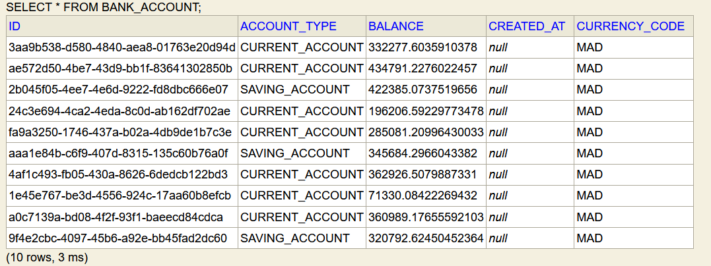

## Activity 1 
### Micro-services Spring 
#### Initializing the project 


There is two types of Spring:
1. Classic Spring MVC, Based on the imperative programming.
2. Reactive Spring (WebFlux), Based on the interactive programming.

Resources:
[Part 1- De L'impératif vers le réactif- Reactive Programming avec Spring Web FLUX-Concepts de base: Professeur Mohamed YOUSSFI](https://www.youtube.com/watch?v=h58yIiHgoBg)
[Build Reactive RESTFUL APIs using Spring Boot/WebFlux : Code With Dilip  19](https://www.youtube.com/watch?v=IK26KdGRl48&list=PLnXn1AViWyL70R5GuXt_nIDZytYBnvBdd)


<fieldset>
    <legend>Note:</legend>
    Intellij Idea could throw a maven error 

```diff
-Plugin 'org.springframework.boot:spring-boot-maven-plugin:' not found or can not be resolved
```
that can be solved by adding the version of the plugin in the pom.xml, which is the same of spring boot's version. (and it's working since spring boot 2.2 until 2.7.X)

```xml
<plugin>
    <groupId>org.springframework.boot</groupId>
    <artifactId>spring-boot-maven-plugin</artifactId>
    <version>${project.parent.version}</version>
    <configuration>
        <excludes>
            <exclude>
                <groupId>org.projectlombok</groupId>
                <artifactId>lombok</artifactId>
            </exclude>
        </excludes>
    </configuration>
</plugin>
```
</fieldset>


#### Entities 
[BankAccount Entity](src/main/java/me/elaamiri/bankaccountmicroservice/entities/BankAccount.java)
````java
@Entity
@Data
@AllArgsConstructor
@NoArgsConstructor
@Builder
/*
Builder is a design pattern : https://refactoring.guru/design-patterns/builder
Builder is a creational design pattern that lets you construct complex objects step by step. The pattern allows you to produce different types and representations of an object using the same construction code.

*/
public class BankAccount {
    @Id
    private String id;
    @DateTimeFormat(pattern = "YYYY-MM-DD")
    @Temporal(TemporalType.DATE)
    private Date createdAt;
    // private double balance;
    private Double balance; // to avoid error on update
    @Enumerated(EnumType.STRING)
    private CurrencyCode currencyCode;
    @Enumerated(EnumType.STRING)
    private AccountType accountType;

}
````

**Notes**:
- [Builder pattern](https://refactoring.guru/design-patterns/builder)


#### Repositories 
[BankAccountRepository](src/main/java/me/elaamiri/bankaccountmicroservice/repositories/BankAccountRepository.java)

````java
@Repository
public interface BankAccountRepository extends JpaRepository<BankAccount, String> {
}
````

#### Configring our App
````properties
spring.datasource.url=jdbc:h2:mem:accounts-db
spring.h2.console.enabled=true
server.port=8081
````

#### Testing our implementation

In the main point [BankAccountMicroServiceApplication](src/main/java/me/elaamiri/bankaccountmicroservice/BankAccountMicroServiceApplication.java)
````java
@Bean
	CommandLineRunner start(BankAccountRepository bankAccountRepository){
            return new CommandLineRunner() {
    @Override
    public void run(String... args) throws Exception {
            // creating some test data
            for (int i=0; i<10; i++ ){
            // using the builder
            BankAccount bankAccount = BankAccount.builder()
            .id(UUID.randomUUID().toString())
            .accountType(Math.random()>0.5 ? AccountType.CURRENT_ACCOUNT : AccountType.SAVING_ACCOUNT)
            .balance(2000+ (Math.random() * 500000))
            .currencyCode(CurrencyCode.MAD)
            .build();
            bankAccountRepository.save(bankAccount);
            }
            }
            };
            }
````


>> It seems like, the application have been started in a big duration (13 seconds),
> and that is not normal.
> As a solution we could create Native applications using

[GraalVM](https://www.graalvm.org/)

> It is a virtual machine lets us recompile jar files to be Native apps.
> "GraalVM is a high-performance JDK distribution designed to accelerate the execution of applications written in Java and other JVM languages along with ..."

[Run Code in Any Language Anywhere with GraalVM : Oracle Developers](https://www.youtube.com/watch?v=JoDOo4FyYMU)

#### Res
Visit : `http:localhost:8081/h2-console`



#### Controllers (Web)

[BankAccountController](src/main/java/me/elaamiri/bankaccountmicroservice/controllers/BankAccountController.java)

````java

@RestController
@RequestMapping("/api")
public class BankAccountController {
    // Dependency injection by constructor
    BankAccountRepository bankAccountRepository;
    public BankAccountController(BankAccountRepository bankAccountRepository){
        this.bankAccountRepository = bankAccountRepository;
    }


    // Routes
    @GetMapping("/bankAccounts")
    /*
    The route has the same name of the entity
     */
    public List<BankAccount> getBankAccounts(){
        return bankAccountRepository.findAll();
    }

    @GetMapping("/bankAccounts/{bankAccountId}")
    public BankAccount getBankAccount(@PathVariable(name = "bankAccountId") String bankAccountId){
        return bankAccountRepository.findById(bankAccountId)
                .orElseThrow(()-> new RuntimeException(String.format("No bankAccount with the ID: %s found !", bankAccountId)));

    }

    @PostMapping("/bankAccounts")
    public BankAccount saveBankAccount(@RequestBody(required = true) BankAccount bankAccount){
        bankAccount.setId(UUID.randomUUID().toString());
        return  bankAccountRepository.save(bankAccount);
    }

    @PutMapping("/bankAccounts/{bankAccountId}")
    public BankAccount updateBankAccount(@RequestBody(required = true) BankAccount bankAccount, @PathVariable String bankAccountId){
        BankAccount bankAccount1 = bankAccountRepository.findById(bankAccountId).orElse(null);
        /**
         * Tests to filter if the user does not update a field
         */
        if(bankAccount1 == null) new RuntimeException(String.format("No bankAccount with the ID: %s found !", bankAccountId));
        if (bankAccount.getBalance() != null) bankAccount1.setBalance(bankAccount.getBalance());
        if (bankAccount.getCreatedAt() != null) bankAccount1.setCreatedAt(bankAccount.getCreatedAt());
        if (bankAccount.getAccountType() != null) bankAccount1.setAccountType(bankAccount.getAccountType());
        if (bankAccount.getCurrencyCode() != null) bankAccount1.setCurrencyCode(bankAccount.getCurrencyCode());
        return bankAccountRepository.save(bankAccount1);
    }

    @DeleteMapping("/bankAccounts/{bankAccountId}")
    public void deleteBankAccount(@PathVariable String bankAccountId){
        bankAccountRepository.deleteById(bankAccountId);
    }
}

````

#### Tests

`http://localhost:8081/api/bankAccounts/8479595d-5e67-4fec-b903-4ead82fbef72`

````json
{"id":"8479595d-5e67-4fec-b903-4ead82fbef72","createdAt":null,"balance":183873.7431515834,"currencyCode":"MAD","accountType":"SAVING_ACCOUNT"}
````
`http://localhost:8081/api/bankAccounts/`

```json
[
    {
        "id": "8479595d-5e67-4fec-b903-4ead82fbef72",
        "createdAt": null,
        "balance": 183873.7431515834,
        "currencyCode": "MAD",
        "accountType": "SAVING_ACCOUNT"
    },
    {
        "id": "fdc40256-9a52-49be-88c3-c2502049bfd4",
        "createdAt": null,
        "balance": 289092.2054572128,
        "currencyCode": "MAD",
        "accountType": "SAVING_ACCOUNT"
    },
    {
        "id": "765d1160-70ed-4bd5-83a6-b56dfb53779c",
        "createdAt": null,
        "balance": 462604.50693428,
        "currencyCode": "MAD",
        "accountType": "SAVING_ACCOUNT"
    },
    {
        "id": "67072645-6a81-4a5a-8499-9f944b0a9674",
        "createdAt": null,
        "balance": 136415.3308109221,
        "currencyCode": "MAD",
        "accountType": "CURRENT_ACCOUNT"
    },
    {
        "id": "5b5533b5-404c-448d-8a8d-65dbe0d9c0a1",
        "createdAt": null,
        "balance": 79710.39542196134,
        "currencyCode": "MAD",
        "accountType": "CURRENT_ACCOUNT"
    },
    {
        "id": "7ee29843-dd5c-44b3-a85f-a8dc7efa8b9f",
        "createdAt": null,
        "balance": 315153.6307580424,
        "currencyCode": "MAD",
        "accountType": "SAVING_ACCOUNT"
    },
    {
        "id": "c853d3cc-bd5d-4902-b6a5-95335cff12c2",
        "createdAt": null,
        "balance": 273990.5395007575,
        "currencyCode": "MAD",
        "accountType": "SAVING_ACCOUNT"
    },
    {
        "id": "5696c3e0-35ea-46c0-8cc0-090f9a0715c9",
        "createdAt": null,
        "balance": 377142.2464782732,
        "currencyCode": "MAD",
        "accountType": "SAVING_ACCOUNT"
    },
    {
        "id": "e071bf08-8839-490d-b00a-c603e7b67a39",
        "createdAt": null,
        "balance": 144073.02288542545,
        "currencyCode": "MAD",
        "accountType": "SAVING_ACCOUNT"
    },
    {
        "id": "8d3d767a-85c8-4e03-84ff-f06cf5b71a01",
        "createdAt": null,
        "balance": 14056.283920548361,
        "currencyCode": "MAD",
        "accountType": "CURRENT_ACCOUNT"
    }
]
```

```json
POST:
{
        "createdAt": "2022-09-22",
        "balance": 377142.02,
        "currencyCode": "MAD",
        "accountType": "SAVING_ACCOUNT"
    }
Response:

{
    "id": "3764e924-93e8-4d2d-82d7-7667526ca5d6",
    "createdAt": "2022-09-22T00:00:00.000+00:00",
    "balance": 377142.02,
    "currencyCode": "MAD",
    "accountType": "SAVING_ACCOUNT"
}
```

````json
PUT:
{
"createdAt": "2022-09-22",
"balance": 200.02
}

Response:
{
"id": "3764e924-93e8-4d2d-82d7-7667526ca5d6",
"createdAt": "2022-09-22T00:00:00.000+00:00",
"balance": 200.02,
"currencyCode": "MAD",
"accountType": "SAVING_ACCOUNT"
}
````


#### Notes:
- With SAOP , we must return XML result necessarily 
- With REST, we are free to use JSON, XML