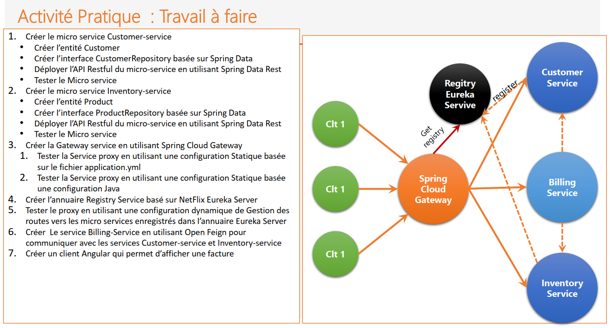
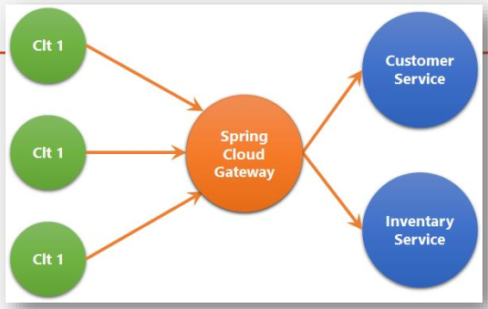
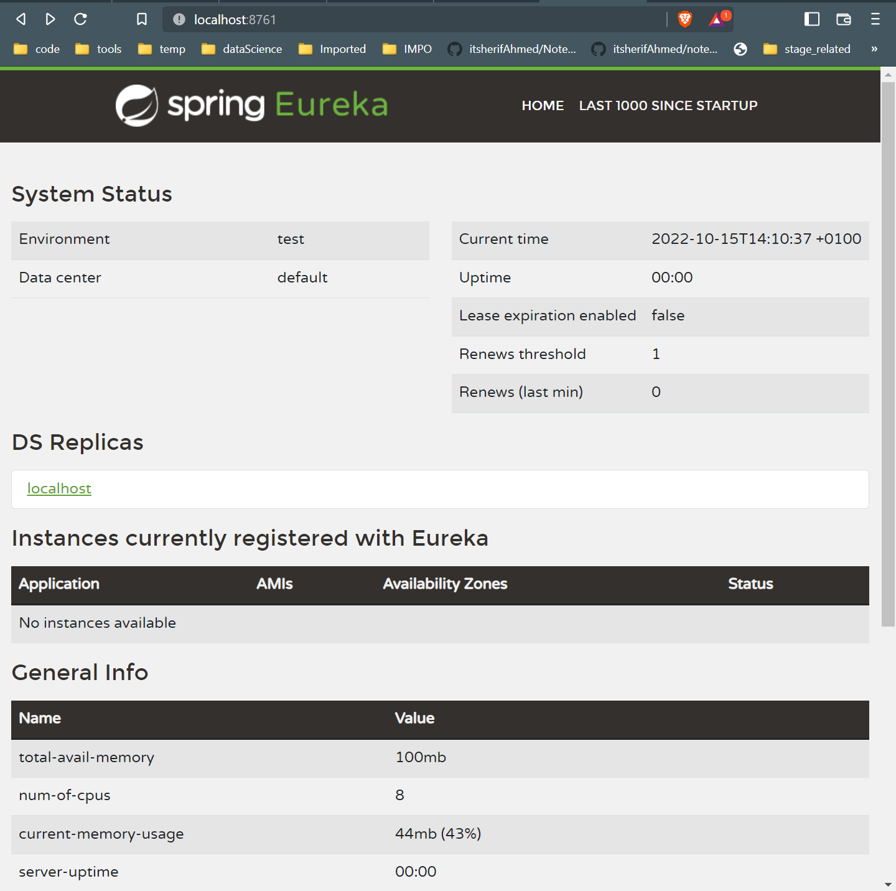
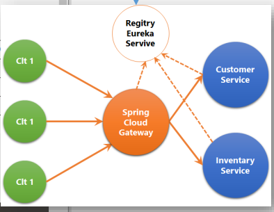
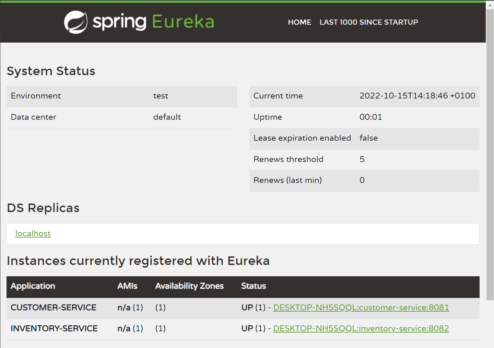
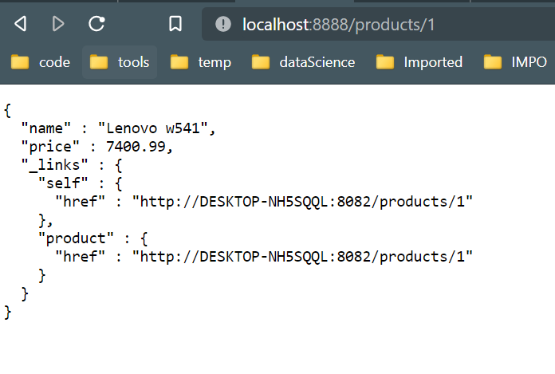
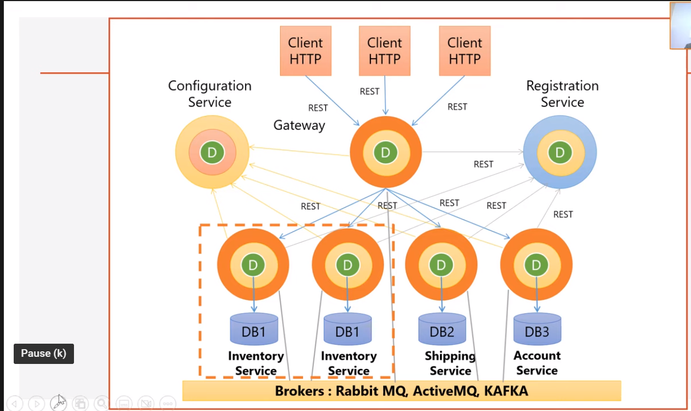
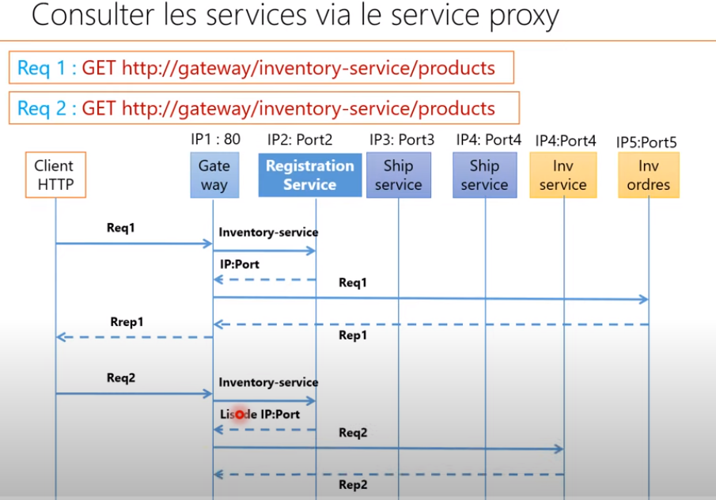
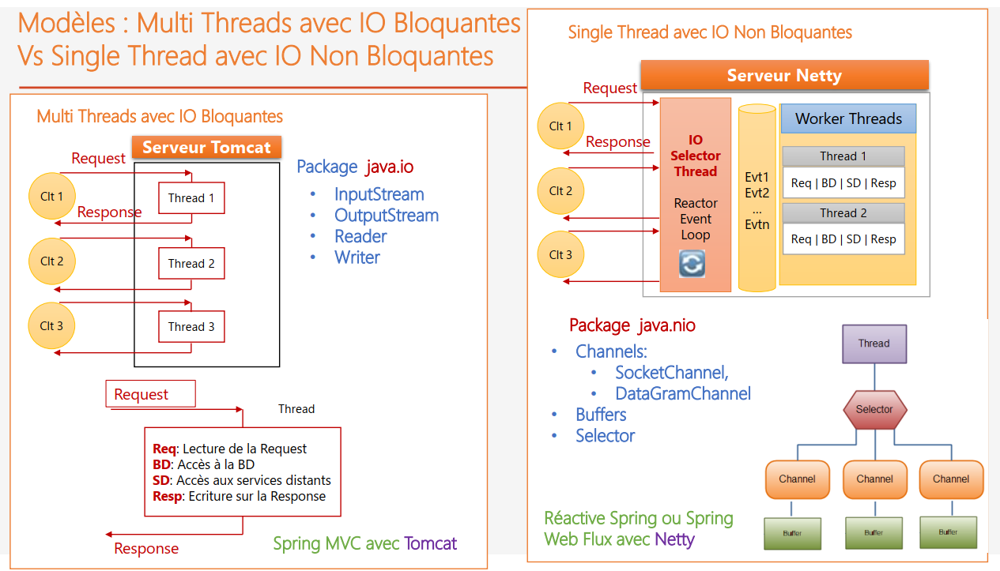
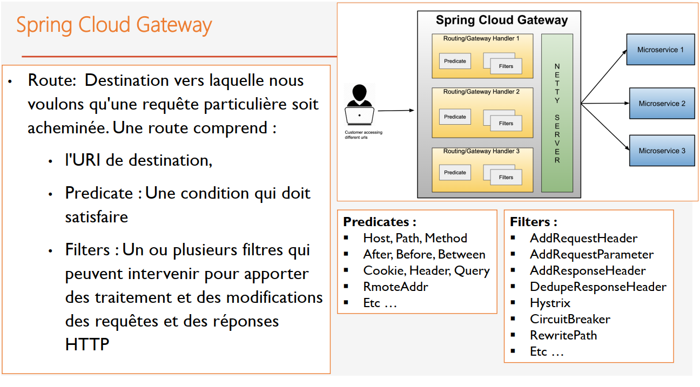

# Microservices


TAF 



<section id="content">

- [Part 1: practical app](#microservices-practical-app)
    - [Creating customer-service microservice](#creating-customer-service-microservice)
    - [Creating inventory-service microservice](#creating-inventory-service-microservice)
    - [Creating gateway-service microservice](#creating-gateway-service-microservice)
        - [Static routes configuration application.yml](#static-routes-configuration-applicationyml)
        - [Static routing using Java Config Class (Static routes configuration)](#static-routing-using-java-config-class)
        - [Dynamic routing using Eureka Discovery Service (Adding Registry Eureka service)](#dynamic-routing-using-eureka-discovery-service)
        - [Static routes configuration using Discovery Service](#static-routes-configuration-using-discovery-service)
        - [Dynamic routes configuration with Discovery Service](#dynamic-routes-configuration-with-discovery-service)
- [Part 2: technical info](#technical-info)
    - [How microservices work ?](#how-microservices-work-)
    - [Spring Cloud Gateway vs Zuul](#spring-cloud-gateway-vs-zuul)
    - [Multi Threads avec IO Bloquantes Vs Single Thread avec IO Non Bloquantes](#multi-threads-avec-io-bloquantes-vs-single-thread-avec-io-non-bloquantes)

</section>

## Microservices practical app

### Creating customer-service microservice
Installing extensions :

```xml
<dependencies>
		<dependency>
			<groupId>org.springframework.boot</groupId>
			<artifactId>spring-boot-starter-actuator</artifactId>
		</dependency>
		<dependency>
			<groupId>org.springframework.boot</groupId>
			<artifactId>spring-boot-starter-data-jpa</artifactId>
		</dependency>
		<dependency>
			<groupId>org.springframework.boot</groupId>
			<artifactId>spring-boot-starter-web</artifactId>
		</dependency>
		<dependency>
			<groupId>org.springframework.cloud</groupId>
			<artifactId>spring-cloud-starter-netflix-eureka-client</artifactId>
		</dependency>

		<dependency>
			<groupId>org.springframework.boot</groupId>
			<artifactId>spring-boot-devtools</artifactId>
			<scope>runtime</scope>
			<optional>true</optional>
		</dependency>
		<dependency>
			<groupId>com.h2database</groupId>
			<artifactId>h2</artifactId>
			<scope>runtime</scope>
		</dependency>
		<dependency>
			<groupId>org.projectlombok</groupId>
			<artifactId>lombok</artifactId>
			<optional>true</optional>
		</dependency>
        <dependency>
            <groupId>org.springframework.boot</groupId>
            <artifactId>spring-boot-starter-data-rest</artifactId>
        </dependency>
    <dependency>
        <groupId>org.springframework.boot</groupId>
        <artifactId>spring-boot-starter-validation</artifactId>
    </dependency>
	</dependencies>

```

- **Spring Web** : Build web, including RESTful, applications using Spring MVC. Uses Apache Tomcat as the default embedded container.
- **Spring Data JPA** : Persist data in SQL stores with Java Persistence  API using Spring Data and Hibernate.
- **H2 Database** : Provides a fast in-memory database that supports JDBC API and R2DBC access, with a small (2mb) footprint. Supports embedded and server modes as well as a browser-based console application.
- **Rest Repositories** : Exposing Spring Data repositories over REST via  Spring Data REST.
- **Lombok**: Java annotation library which helps to reduce boilerplate code.
- **Spring Boot DevTools** : Provides fast application restarts,  LiveReload, and configurations for enhanced development experience.
- **Eureka Discovery Client** : a REST based service for locating services for the purpose of load balancing and failover of middletier servers.
- **Spring Boot Actuator** : Supports built in (or custom) endpoints that  let you monitor and manage your application - such as application  health, metrics, sessions, etc.
- **Spring validation**: validating entity fields.

Properties file :
````properties
spring.cloud.discovery.enabled= false
server.port=8081
spring.application.name=customer-service

````

`spring.cloud.discovery.enabled= false`: pour dire au service que c'est pas la penne de chercher un discovery service (حيت باقي ماكاينش ههه). 

About Spring boot validation : https://reflectoring.io/bean-validation-with-spring-boot/

Some of the most common validation annotations are:

- @NotNull: to say that a field must not be null.
- @NotEmpty: to say that a list field must not empty.
- @NotBlank: to say that a string field must not be the empty string (i.e. it must have at least one character).
- @Min and @Max: to say that a numerical field is only valid when it’s value is above or below a certain value.
- @Pattern: to say that a string field is only valid when it matches a certain regular expression.
- @Email: to say that a string field must be a valid email address.

Customer entity:

````java

@Entity @Data @AllArgsConstructor @NoArgsConstructor @ToString @Builder
public class Customer {

    @Id
    @GeneratedValue(strategy = GenerationType.IDENTITY)
    private Long id;
    @NotBlank
    private String name;
    @Email
    private String email;
}

````

Repository + rest sources

````java

@RepositoryRestResource
public interface CustomerRepository extends JpaRepository<Customer, Long> {
}

````

In the application we test

```java
@SpringBootApplication
public class CustomerServiceApplication {
    //..... main 
    @Bean
    CommandLineRunner start(CustomerRepository customerRepository){
        return  args -> {
            customerRepository.save(new Customer(null, "Essadeq", "essade@gmail.com"));
            customerRepository.save(new Customer(null, "Mariam", "mariam@gmail.com"));
            customerRepository.save(new Customer(null, "Laila", "la88745@gmail.com"));
            customerRepository.save(new Customer(null, "Consal", "sal87@gmail.com"));
            customerRepository.save(new Customer(null, "Zadeq", "pakista@gmail.com"));

            customerRepository.findAll().forEach(System.out::println);
        };
    }
}
```

Result :

````textmate
Customer(id=1, name=Essadeq, email=essade@gmail.com)
Customer(id=2, name=Mariam, email=mariam@gmail.com)
Customer(id=3, name=Laila, email=la88745@gmail.com)
Customer(id=4, name=Consal, email=sal87@gmail.com)
Customer(id=5, name=Zadeq, email=pakista@gmail.com)
````

Visiting : `localhost:8081/actuator` will give us some monitoring about our application.
    - `localhost:8081/actuator/health` --> `{"status" : "UP" }`

Everything is fine, but why `System.out::println` :
<details>
The method reference System.out::println will evaluate System.out first, then create the equivalent of a lambda expression which captures the evaluated value. Usually, you would use
o -> System.out.println(o) to achieve the same as the method reference, but this lambda expression will evaluate System.out each time the method will be called.

So an exact equivalent would be:

````java
PrintStream p = Objects.requireNonNull(System.out);
numbers.forEach(o -> p.println(o));
````

which will make a difference if someone invokes System.setOut(…); in-between.
link : https://stackoverflow.com/questions/28023364/what-is-the-equivalent-lambda-expression-for-system-outprintln 
</details>

Visiting : `http://localhost:8081/customers/1`

```json
{
  "name" : "Essadeq",
  "email" : "essade@gmail.com",
  "_links" : {
    "self" : {
      "href" : "http://localhost:8081/customers/1"
    },
    "customer" : {
      "href" : "http://localhost:8081/customers/1"
    }
  }
}
```

### Creating inventory-service microservice
Service project file link : https://github.com/essadeq-elaamiri/microservices-practical-activities-s5/tree/main/inventory-service

- Creating other spring project
- Adding the same dependencies as the first microservice (Customer-service)

Config

```properties
spring.application.name=inventory-service
spring.cloud.discovery.enabled=false
server.port=8082
```

Entity :
````java
@Entity @Data @AllArgsConstructor @NoArgsConstructor @ToString @Builder
public class Product {
    @Id
    @GeneratedValue(strategy = GenerationType.IDENTITY)
    private Long id;
    private String name;
    private double price;
}

````

Repo :

```java
@RepositoryRestResource
public interface ProductRepository extends JpaRepository<Product, Long> {
}
```
Testing :
```java
@SpringBootApplication
public class InventoryServiceApplication {
    // main ...
	@Bean
	CommandLineRunner start(ProductRepository productRepository){
		return args -> {
			productRepository.save(new Product(null, "Lenovo w541", 7400.99));
			productRepository.save(new Product(null, "HP 478S", 10000.99));
			productRepository.save(new Product(null, "MacPro 2023", 17400.99));
			productRepository.save(new Product(null, "KitMan hj", 700.99));

			productRepository.findAll().forEach(System.out::println);
		};
	}
}
```

Res:
````textmate
Product(id=1, name=Lenovo w541, price=7400.99)
Product(id=2, name=HP 478S, price=10000.99)
Product(id=3, name=MacPro 2023, price=17400.99)
Product(id=4, name=KitMan hj, price=700.99)
````
Visiting: `http://localhost:8082/products/1`

```json
{
  "name" : "Lenovo w541",
  "price" : 7400.99,
  "_links" : {
    "self" : {
      "href" : "http://localhost:8082/products/1"
    },
    "product" : {
      "href" : "http://localhost:8082/products/1"
    }
  }
}
```
--> Tous va bien

> Now I have 2 microservices, let's create the Gateway

### Creating gateway-service microservice
Service project file link : https://github.com/essadeq-elaamiri/microservices-practical-activities-s5/tree/main/gateway-service

- Creating other spring project
- Adding the  dependencies

```xml
<dependencies>
		<dependency>
			<groupId>org.springframework.boot</groupId>
			<artifactId>spring-boot-starter-actuator</artifactId>
		</dependency>
		<dependency>
			<groupId>org.springframework.cloud</groupId>
			<artifactId>spring-cloud-starter-gateway</artifactId>
		</dependency>
		<dependency>
			<groupId>org.springframework.cloud</groupId>
			<artifactId>spring-cloud-starter-netflix-eureka-client</artifactId>
		</dependency>
		<!-- https://mvnrepository.com/artifact/org.springframework.cloud/spring-cloud-starter-hystrix -->
		<dependency>
			<groupId>org.springframework.cloud</groupId>
			<artifactId>spring-cloud-starter-hystrix</artifactId>
			<version>1.4.7.RELEASE</version>
		</dependency>
	</dependencies>
```

- **Gateway** : Provides a simple, yet effective way  to route to APIs and provide cross cutting concerns to them such as security, monitoring/metrics, and resiliency.
- **Spring Boot Actuator** : Supports built in (or custom) endpoints that let you monitor and manage your application - such as application health, metrics, sessions, etc.
- **Hystrix** : Circuit breaker with Spring Cloud Netflix Hystrix.
- **Eureka Discovery Client** : a REST based service for locating services for the purpose of load balancing and failover of middle-tier servers

#### Static routes configuration application.yml


Configuration using `application.yml` instead of `application.properties`

```yml
spring:
  cloud:
    gateway:
      routes:
        - id : route1
          uri: http://localhost:8081/
          predicates:
            - Path= /customers/**
        - id: route2
          uri: http://localhost:8082/
          predicates:
            - Path= /products/** # if path starts with /products/** send request to http://localhost:8082/
      discovery:
        locator:
          enabled: false
server:
  port: 8888
```



Testing:

```diff
- org.springframework.beans.factory.BeanDefinitionStoreException: Failed to process import candidates for configuration class [me.elaamiri.gatewayservice.GatewayServiceApplication]; nested exception is java.io.FileNotFoundException: class path resource [org/springframework/boot/autoconfigure/web/ServerPropertiesAutoConfiguration.class] cannot be opened because it does not exist
```

Solution:

use 
```xml
<dependency>
    <groupId>org.springframework.cloud</groupId>
    <artifactId>spring-cloud-starter-netflix-hystrix</artifactId>
    <version>2.2.10.RELEASE</version>
</dependency>
```
instead of :
````xml
<dependency>
    <groupId>org.springframework.cloud</groupId>
    <artifactId>spring-cloud-starter-hystrix</artifactId>
    <version>1.4.7.RELEASE</version>
</dependency>
````

Visiting: `http://localhost:8888/products/1`
````json
{
  "name" : "Lenovo w541",
  "price" : 7400.99,
  "_links" : {
    "self" : {
      "href" : "http://localhost:8082/products/1"
    },
    "product" : {
      "href" : "http://localhost:8082/products/1"
    }
  }
}
````

Visiting : `http://localhost:8888/customers/1`
```json
{
  "name" : "Essadeq",
  "email" : "essade@gmail.com",
  "_links" : {
    "self" : {
      "href" : "http://localhost:8081/customers/1"
    },
    "customer" : {
      "href" : "http://localhost:8081/customers/1"
    }
  }
}
```

--> OK 200

#### Static routing using Java Config Class 
Static routes configuration 
utilisation d'un `bean` de configuration des routes

````java
@SpringBootApplication
public class GatewayServiceApplication {
    // .... main 
	@Bean
	RouteLocator gatewayRoutes(RouteLocatorBuilder builder){
		return builder.routes()
				.route(id, r -> r.path("/customers/**").uri("http://localhost:8081"))
				.route(id, r -> r.path("/products/**").uri("http://localhost:8082"))
				.build();
	}

}
````
// Just the same results 

> On utilise la configuration static lorsque on sait les adresses des micro-services (avec un seul instance chaq'un) ...
> Dans un autre cas ou on ne sait pas, on va utiliser routage dynamique avec discovery service

#### Dynamic routing using Eureka Discovery Service
[Adding Registry Eureka service]

Eureka is an implementation of discovery service by Netflix.

[:top:](#content)


Project file link: https://github.com/essadeq-elaamiri/microservices-practical-activities-s5/tree/main/discovery-service

- Creating discovery-service (Eureka Discovery Service)
- Installing the dependency:

  **Eureka Server** : spring-cloud-netflix Eureka Server

- Configuration it as a discovery server

`````properties
server.port=8761
# do not register server as a client (it is the server now)
eureka.client.fetch-registry=false
# Does not register itself in the service registry (discovery server)
eureka.client.register-with-eureka=false
`````

- EnableEurekaServer on the applications

````java
		
@SpringBootApplication
@EnableEurekaServer
public class DiscoveryServiceApplication {

	public static void main(String[] args) {
		SpringApplication.run(DiscoveryServiceApplication.class, args);
	}

}
````




- Permettre à Customer-service et Invotory-service de s’enregistrer chez Eureka server
- Allow Customer-service and Invotory-service to register with Eureka server

In customer-service properties :

````properties
spring.cloud.discovery.enabled= true
server.port=8081
spring.application.name=customer-service
management.endpoints.web.exposure.include=*
eureka.client.service-url.defaultZone=http://localhost:8761/eureka

````

In inventory-service properties :

````properties
spring.cloud.discovery.enabled= true
server.port=8082
spring.application.name=inventory-service
eureka.client.service-url.defaultZone=http://localhost:8761/eureka
````



#### Static routes configuration using Discovery Service

In the RouterLocator (Gateway-service), we so a static routes config with discovery Service

````java

@SpringBootApplication
public class GatewayServiceApplication {

	public static void main(String[] args) {
		SpringApplication.run(GatewayServiceApplication.class, args);
	}

//	@Bean
//	RouteLocator gatewayRoutes(RouteLocatorBuilder builder){
//		return builder.routes()
//				.route(r -> r.path("/customers/**").uri("http://localhost:8081"))
//				.route(r -> r.path("/products/**").uri("http://localhost:8082"))
//				.build();
//	}

	@Bean // Dynamic using the discovery
	RouteLocator gatewayRoutes(RouteLocatorBuilder builder){
		return builder.routes()
				.route(r -> r.path("/customers/**").uri("lb://COSTUMER-SERVICE"))
				.route(r -> r.path("/products/**").uri("lb://INVENTORY-SERVICE"))
				.build();
	}

}

````



#### Dynamic routes configuration with Discovery Service
[:top:](#content)

In the gateway properties :
````properties
spring.application.name=gateway-service
spring.cloud.discovery.enabled=true
server.port=8888
````
Adding DiscoveryClientRouteDefinitionLocator

```java

@SpringBootApplication
public class GatewayServiceApplication {

	public static void main(String[] args) {
		SpringApplication.run(GatewayServiceApplication.class, args);
	}

//	@Bean
//	RouteLocator gatewayRoutes(RouteLocatorBuilder builder){
//		return builder.routes()
//				.route(r -> r.path("/customers/**").uri("http://localhost:8081"))
//				.route(r -> r.path("/products/**").uri("http://localhost:8082"))
//				.build();
//	}

//	@Bean // Dynamic using the discovery
//	RouteLocator gatewayRoutes(RouteLocatorBuilder builder){
//		return builder.routes()
//				.route(r -> r.path("/customers/**").uri("lb://COSTUMER-SERVICE"))
//				.route(r -> r.path("/products/**").uri("lb://INVENTORY-SERVICE"))
//				.build();
//	}


	@Bean
	DiscoveryClientRouteDefinitionLocator dynamicRoutes(ReactiveDiscoveryClient reactiveDiscoveryClient,
														DiscoveryLocatorProperties discoveryLocatorProperties){
		return new DiscoveryClientRouteDefinitionLocator(reactiveDiscoveryClient, discoveryLocatorProperties);
	}
}

```

Visiting : `http://localhost:8888/INVENTORY-SERVICE/products/1`
```json
{
  "name" : "Lenovo w541",
  "price" : 7400.99,
  "_links" : {
    "self" : {
      "href" : "http://DESKTOP-NH5SQQL:8082/products/1"
    },
    "product" : {
      "href" : "http://DESKTOP-NH5SQQL:8082/products/1"
    }
  }
}
```

Visiting : `http://localhost:8888/CUSTOMER-SERVICE/customers/1`

```json
{
  "name" : "Essadeq",
  "email" : "essade@gmail.com",
  "_links" : {
    "self" : {
      "href" : "http://DESKTOP-NH5SQQL:8081/customers/1"
    },
    "customer" : {
      "href" : "http://DESKTOP-NH5SQQL:8081/customers/1"
    }
  }
}
```

> But What I just did  ?? let's discover in the technical info (Théorique)

------------------------------------------------------------
[:top:](#content)

## Technical info

### How microservices work ?



<fieldset>

- `Microservice fonctionnel` : c'est une microservice lié au mitier. Il faut les intégrer dans une architecture microservice.pour cela il faut deployer des `microservices techniques `
- `Microservices techniques`: 
  - [`gateway-service `] : le point d'entré des requetes vers l'architecture (toute requetes externes sont à distanation de la `gateway` ).
  - [`registration-service` ou `discovery-service`]: chaque micro-service qui démarre a besoin de publier son adresse dans ce service. dans dans le `disovery-service` on va trouver les nom et l'adresse de tous les microservices de l'architecture.
    - [`configuration-service`]: pour une configuration globale au lieu de faire un fichier de config pour chaque micro-service.
- Le `gateway` lorsque il reçoit une requete, il fait appel au `discovery-service` pour récupérer l'adresse. Après la request va etre dériger vers le microservice correspondant.
- Le `gateway` utilise un `load balancer` ou bien un `équilibreur de charge` quand il y a plusieurs instances d'un micro-service.et donc chaque requets est envoyée vers une instance.
- Donc parmit les avantages de cette architecture c'est la `scalabilité Horizontale` : c à d, lorsque on a un problème de performance, on démarre des nouvelles instances. qui vont partager la charge.
- On peut écrire un seul fichier de configuration globale, qu'il va etre géré par le service thechnique `configurtion-service`.
- Donc un micro-service quand il démarre, la première chose qu'il fait, c'est d'envoyer une requête vers le service de configuration pour récuperer ça configuration, puis il démarre, il publie son adresse au service `discovery` et par la suite il peut etre invoker par le srvice `gateway`.
- Les microsrvices peuvent récupérer la configuration `à chaud` c à d : sans etre obligé d'arreter les microservices.

</fieldset>



- Note: in the 2 nd request, the `registration / discovery service`, returns a list of adresses, so the `gateway` here will use the `load balancer` to choose the intance to be reached.


### Spring Cloud Gateway vs Zuul

- Gateway API est un reverse proxy amélioré avec des fonctionnalités plus avancées, y compris l'orchestration et la sécurité et le monitoring
- Quelques implémentations de API Gateway :
  - **Netflix Zuul Proxy**, 
  - **Amazon Gateway API**, 
  - **Spring Cloud Gateway**
  
- Il y a deux modèles de gateway qu'on peut utiliser  (Implémentation de Gateway API ):
    - `Zuul`: basé sur les entrés sorties bloquantes. [par Netflix] (Model multithread avec des entrés sorties bloquantes)
      - utilise un thread pour chaque requete entrante.
      - Si aucun thread n'est disponible pour traiter la requête entrante, celle-ci doit attendre dans la file d'attente
    - `Spring Cloud Gateway`:  est un proxy utilisant une API non bloquante. (Model singlethread avec des entrés sorties non bloquantes)
      - Un thread est toujours disponible pour traiter requête entrante.
      -  Ces requêtes sont ensuite traitées de manière asynchrone en arrière-plan et une fois complétées, la réponse est renvoyée.
      -  Ainsi, aucune requête entrante n'est jamais bloquée lors de l'utilisation de Spring Cloud Gateway sauf si les ressources CPU et mémoires sont saturées.

### Multi Threads avec IO Bloquantes Vs Single Thread avec IO Non Bloquantes



**Multithread model**
(PHP, dotNet, Java (-v7))
- Used in `Spring MVC + Tomcat`
- On peut pas utiliser une infinité de threads (200 max dans SpringBoot par defaut).
- Un nombre important de requetes (+ 200 dans ce cas) va nous ramener à la monté en charge (problème de performance).
- Donc le modèle multithread n'est scalable verticalement: uncappable d'exploiter tous les ressources (Car on est limité par le nombre des threads).
- La performance du serveur est dépand au consomateur (client), s'il a par exemples des problèmes au niveau de connexion (faible H+ ..), il va mobiliser les thread de sa requet pendant une longe durée.
- La latence du réseau impact la performance de ce modèle.
- Il marche bien si les requetes vont etre traitées dans une durée courte. 

**Single thread model**
(Nodejs, Java (+v7, with `java.nio`))
- Used in `Reactive Spring or Spring Web Flux + Netty`
- Uses an **event loop** : boucle infinie, utilise une single thread pour traiter toutes les requets.
- Utilise la programmation asynchrone.
- Le premier serveur qui a impléenté ce modèle là est: `Netty`.
- **Problèmes**: si par example le serveur a 8 ceurs (processeur), le modèle exploite un seul.
- **Solution**: Utilisation des `Worker threads`, le `IO Selector thread` les utilisents pour traiter la requete.
- Pour utiliser ce modèle il faut assurer que toutes les entrées sorties sont non bloquante (même pour les drivers des bases de données): `[Utiliser Reactive JDBC au lien de JDBC]`
- C'est modèle qui scalable verticalement (On peut ajouter de la mémoire, CPU ... car le modèle exploite tous).
 
### Spring Cloud Gateway Routes




- `Eureka Discovery client ` : permet de connecter le microservice avec de discovery service pour s'enregister.
-  `Eureka Discovery Server `: installée pour le discovery service
- `Spring boot Actuator`: pour le monitoring et la consultation de la santé de notre application (REST endpoints).
- `hystrix` : c'est une implémentation du pattern `Circuit breaker` 

[:top:](#content)
